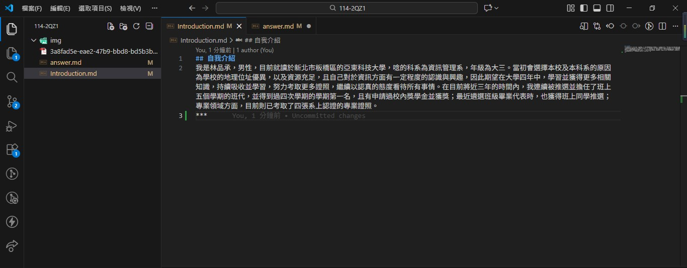
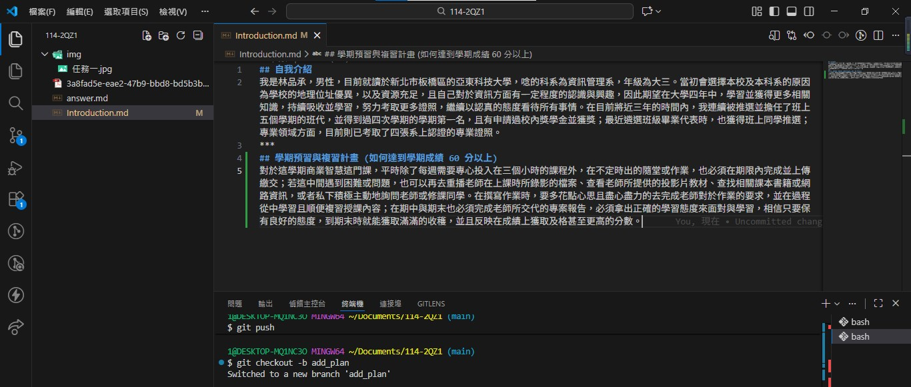
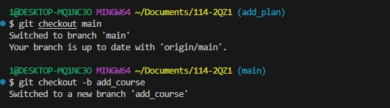
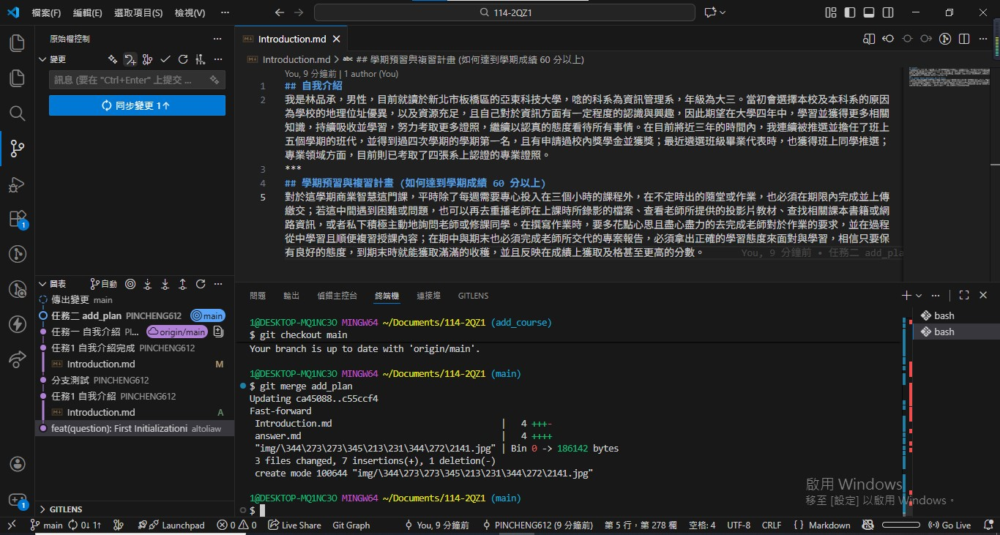
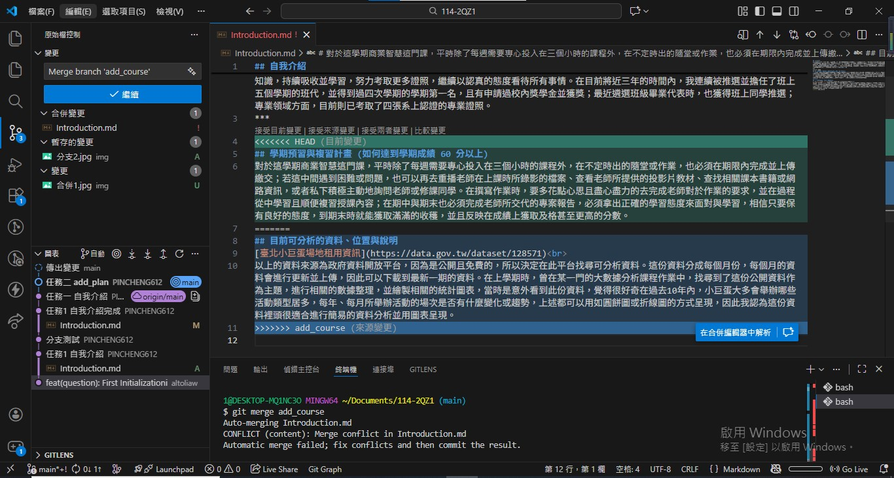
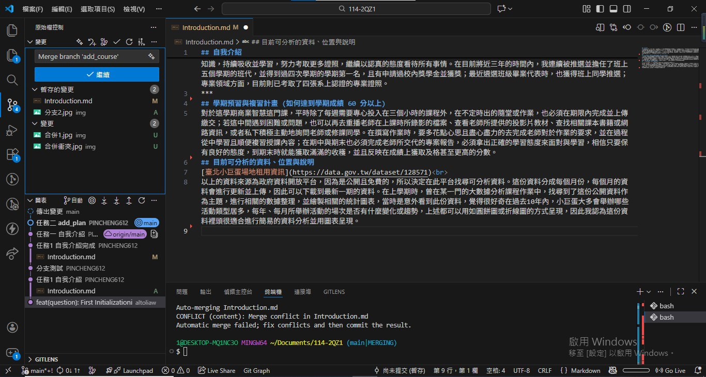

# 第1次隨堂題目-隨堂-QZ1
>
>學號：112111113
> 
>姓名：林品承
>

本份文件包含以下主題：(至少需下面兩項，若是有多者可以自行新增)
- [x] 說明內容

# 1. 任務一

Ans: 
## 個人自我介紹撰寫

# 2. 任務二

Ans: 
## 在新分支 add_plan 撰寫學期預習與複習計畫後，回到 main ，再切換至另一新分支 add_course 撰寫⽬前可分析的資料、位置與說明

# 3. 任務三

Ans: 
## 切回至 main 與 add_plan 分支進行合併

## 接著繼續與 add_course 合併時，會出現合併衝突。此時要點選第四行<<<<<<< HEAD 上面的「接受兩者變更」即可

## 合併後的結果
